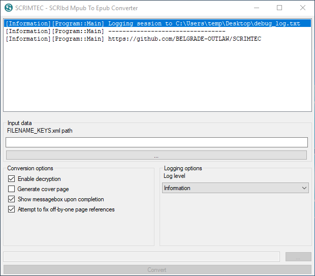

# SCRIMTEC - SCRIbd MPUB to EPUB Converter

## Download
https://github.com/BELGRADE-OUTLAW/SCRIMTEC/releases

## Features
- Converts MPUB to EPUB
- Decrypts DRM-encrypted books
- Decodes DRM-encoded PDF files*, such as sheet music

_* only files that don't start with `%PDF` and are named **content** (without extension)_

## Compiling
- Visual Studio 2019
- .NET Framework 4.7.2
- C# 8.0

When you open the solution, make sure to install Newtonsoft.JSON by going to "Tools -> NuGet Package Manager -> Manage NuGet Packages for Solution...", then a "Restore" button should appear in the top right corner, click on it and compile.

## Third-party code
- [Newtonsoft.Json](https://www.newtonsoft.com/json) from NuGet
- Slightly modified [ZipStorer](https://github.com/jaime-olivares/zipstorer)

## Acquiring book data
_(on Android with root access; you can use an emulator)_

1. Download the book(s) from the Scribd application and skip through a few chapters for each one (just so you're sure it has been successfully downloaded; isn't necessary, but recommended)
2. Exit the Scribd application
3. Go to `/data/data/com.scribd.app.reader0/shared_prefs/` and copy `FILENAME_KEYS.xml` to your PC
4. Go to `/storage/emulated/0/Android/data/com.scribd.app.reader0/files/` and copy the entire `document_cache` folder to your PC

## Usage
5. Start SCRIMTEC
6. Click on the big "..." button beneath "`FILENAME_KEYS.xml` path" and locate your `FILENAME_KEYS.xml` file
7. Click on the little "..." button above "Convert" and locate your `document_cache` folder
8. Click convert
9. ???
10. Profit!

## Troubleshooting
If conversion fails, then double check if the files are intact. Files get corrupted oftenly during Android -> PC transfer.

## Android guide using MEmu
1. Download and install MEmu from http://memuplay.com/
2. Download APKPure APK from https://apkpure.com/apkpure-app.html to your PC
3. Start Multi-MEmu
4. Install Android 7.1 x64 by clicking "New" in the bottom right corner
5. Start the newly installed Android 7.1 instance
6. Go to Settings -> Security
   - Scroll down until you see "Unknown sources"
   - Enable this option. A warning should appear, click *OK*
7. Install APKPure APK that you previously downloaded by clicking "APK" in the right-side pane of MEmu
8. Start APKPure and install Scribd
   - If a warning from Google Play Protect shows up, click *ALLOW*
9. Start Scribd and sign in
10. Find a book that you want to convert and download it
    - Optionally, if you run into issues, open the book and drag through each chapter
    - When the download is finished, go back to your Home screen
11. Open APKPure again and install Total Commander, or a file manager of your choice
12. Add bookmarks for faster future navigation. See video on Streamable
    - To add bookmarks in Total Commander, on the right-hand side of the header you will find 4 icons. Click on the one with the star, located left of the search icon
    - Bookmark `/data/data/com.scribd.app.reader0/shared_prefs/`
    - Bookmark `/storage/emulated/0/Android/data/com.scribd.app.reader0/files/`
    - Bookmark the Downloads folder
13. Navigate to the files folder bookmark
    - Copy `document_cache` to clipboard by long-pressing on the folder
    - Click the blue diskette icon next to the big "Total Commander" text
    - Go to the Download folder bookmark and paste the folder there
14. Navigate to the shared_prefs bookmark
    - Copy `FILENAME_KEYS.xml` to clipboard by long-pressing on the file
    - Click the blue diskette icon next to the big "Total Commander" text
    - Go to the Download folder bookmark and paste the file there

After you've done all this, the files can be found in C:/Users/`User`/Downloads/MEmu Download/

Now you can continue with the conversion as described in **Usage**.
